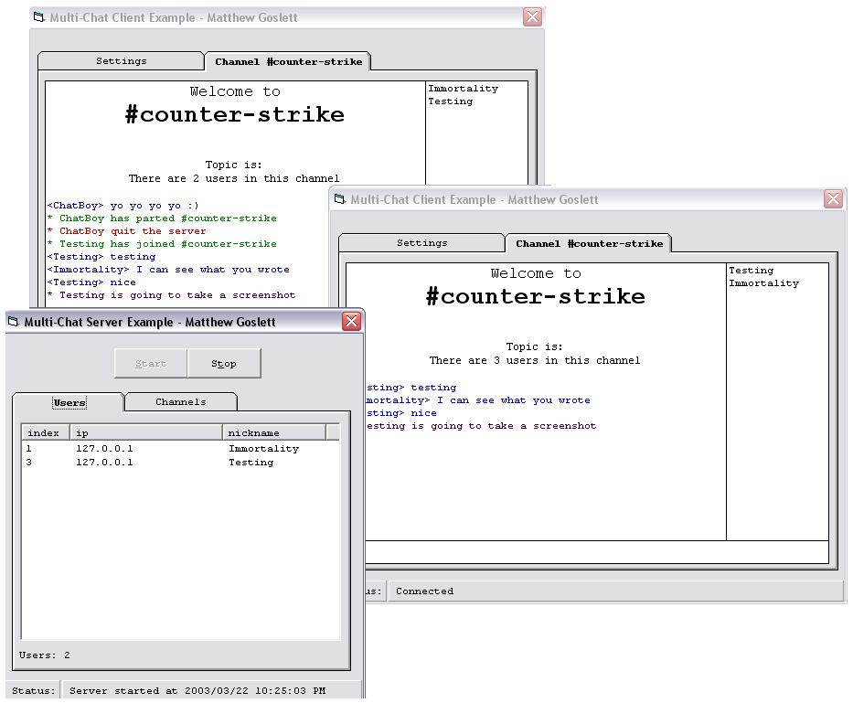



## Multi\-Chat Server and Client

### Description

A server and a client application. Using the winsock array, it's a wonderful example of how to create multiple winsock sockets and a public chat room. The server supports content filtering, blocking all swear words in chat messages, multiple chat channels and actions. Important lines are commented so you will be able to learn from my program. This is an excellent code structure for any socket application and it is incredibly easy to understand.
 
### More Info
 

             |
---                |---
**Submitted On**   |2003-03-21 19:29:58
**By**             |[Matthew Goslett](https://github.com/Planet-Source-Code/PSCIndex/blob/master/ByAuthor/matthew-goslett.md)
**Level**          |Beginner
**User Rating**    |5.0 (25 globes from 5 users)
**Compatibility**  |VB 5\.0, VB 6\.0
**Category**       |[Internet/ HTML](https://github.com/Planet-Source-Code/PSCIndex/blob/master/ByCategory/internet-html__1-34.md)
**World**          |[Visual Basic](https://github.com/Planet-Source-Code/PSCIndex/blob/master/ByWorld/visual-basic.md)
**Archive File**   |[Multi\-Chat1563103222003\.zip](https://github.com/Planet-Source-Code/matthew-goslett-multi-chat-server-and-client__1-44154/archive/master.zip)

